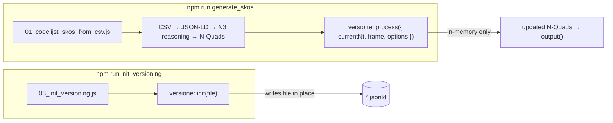
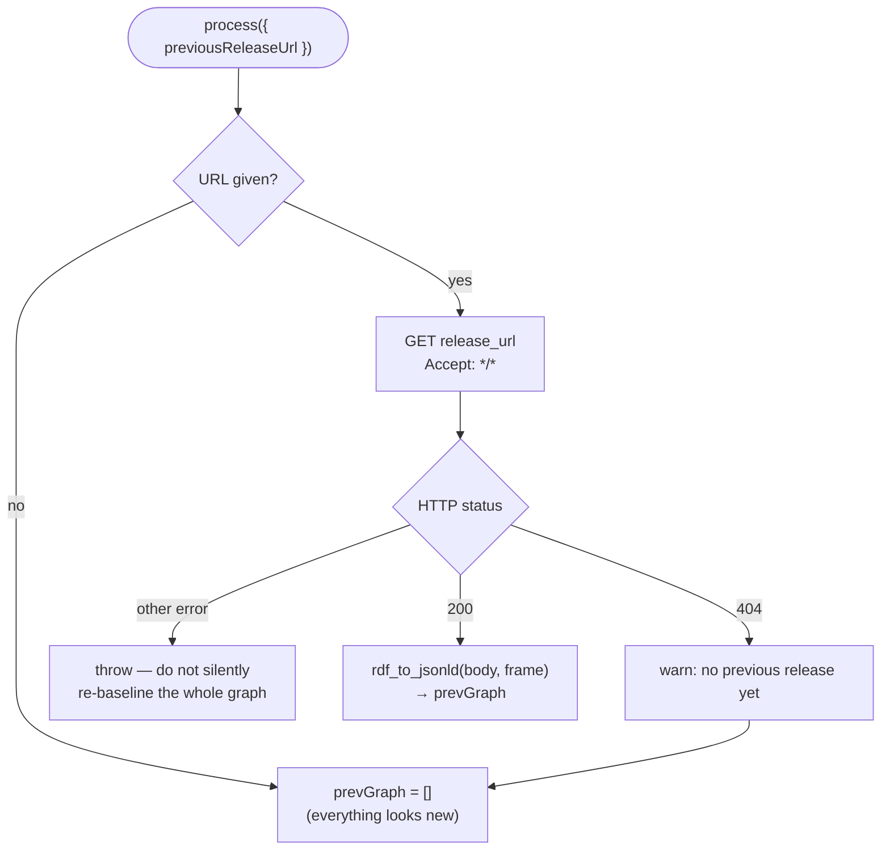
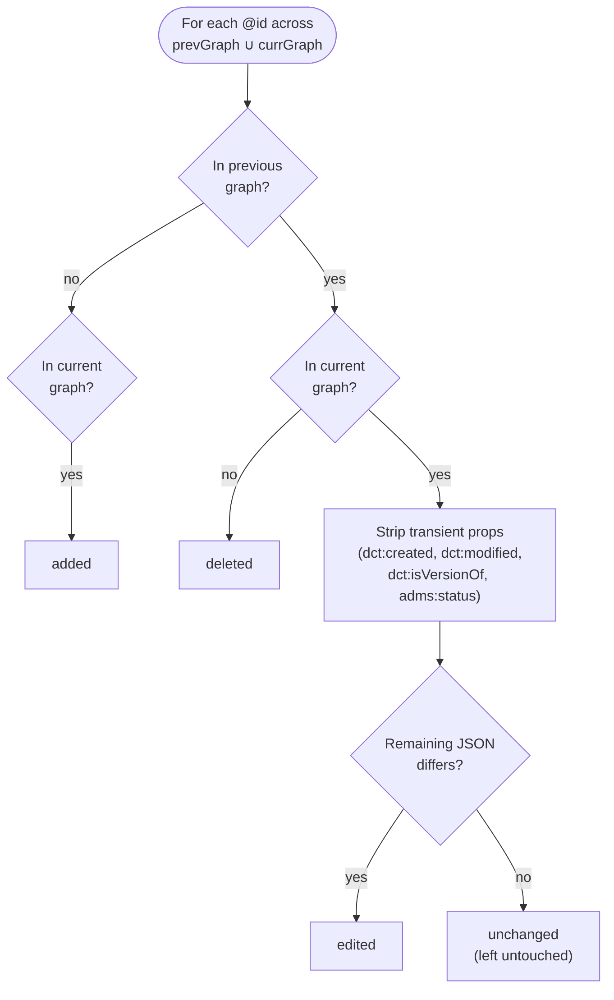
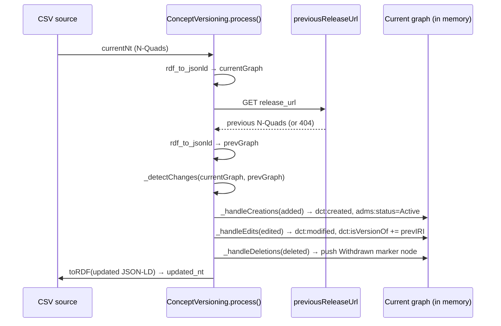
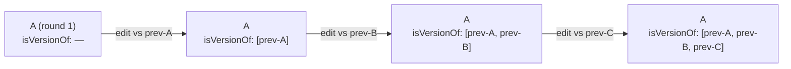
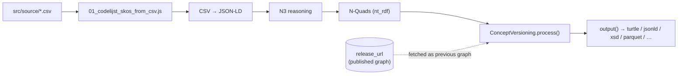

# Concept Versioning

This document explains how `src/utils/versioning.js` (`ConceptVersioning`) tracks
the lifecycle of SKOS concepts as the source CSVs change over time, and how it
fits into the `generate_skos` / `init_versioning` npm scripts.

## Purpose

Every codelist concept is a JSON-LD/RDF node identified by an `@id` (its IRI).
`ConceptVersioning` decorates each node with versioning metadata so consumers
can tell *when* a concept appeared, *when* it last changed, *what it used to
be*, and *whether it's still active*:

| Property | Vocabulary IRI | Meaning |
|---|---|---|
| `dct:created` | `http://purl.org/dc/terms/created` | Timestamp the concept first appeared |
| `dct:modified` | `http://purl.org/dc/terms/modified` | Timestamp of the concept's last edit |
| `dct:isVersionOf` | `http://purl.org/dc/terms/isVersionOf` | Link(s) to the IRI(s) of the previous version(s) of this concept |
| `adms:status` | `http://www.w3.org/ns/adms#status` | Lifecycle status IRI, e.g. `.../adms/status/Active` or `.../Withdrawn` |

These IRIs (and the base IRI used to build status values) are configurable via
the `DEFAULTS` export / constructor `config` argument, but the table above
lists what's used out of the box.

## Two entry points

There are two ways `ConceptVersioning` is invoked, for two different jobs:



- **`init(filePath)`** — a one-off bootstrap. It reads a JSON-LD file from
  disk, and for every node that doesn't already have `dct:created` /
  `adms:status`, stamps it as newly created with status `active`, then writes
  the file back. Used to seed versioning metadata on an existing codelist
  before versioning was tracked.
- **`process({ currentNt, frame, options, previousReleaseUrl })`** — run on
  every SKOS generation (`npm run generate_skos`). It converts the current
  N-Quads graph to JSON-LD, fetches and parses the previously published graph
  from `previousReleaseUrl`, classifies each concept as added / edited /
  deleted relative to that previous graph, applies the corresponding
  metadata, and returns the updated N-Quads plus a summary.

`01_codelijst_skos_from_csv.js` passes `previousReleaseUrl` from the
`versioning` config exported by `src/utils/variables.js`, which reads
`metadata.distribution.versioning` in `src/source/config.yml`:

```yaml
metadata:
  distribution:
    versioning:
      enabled: true
      release_url: https://repo.omgeving.vlaanderen.be/ui/api/v1/download/contentBrowsing/release/be/vlaanderen/omgeving/data/id/graph/codelijst-rie-iepr
```

If `versioning.enabled` is `false`, `previousReleaseUrl` is `undefined` and
`process()` falls back to an empty previous graph (every concept classified
as *added*) — the same as `init()`.

### Fetching the previous graph (`_loadPreviousGraph`)



A `404` is treated as "this is the first-ever release" and versioning
proceeds with an empty previous graph. Any other failure (auth error, 5xx,
network error) **throws** instead of silently falling back — treating a
transient fetch failure as "no previous graph" would re-classify every
existing concept as newly created, wiping out `dct:created` history and
`dct:isVersionOf` lineage for the whole codelist.

## Change detection

`_detectChanges(currentGraph, prevGraph)` compares nodes by `@id` (or `id` /
`uri` / `_id` as fallbacks) across the two graphs:



Stripping the transient/versioning properties before comparing is what makes
the process **idempotent**: re-running it over data that already carries
versioning metadata does not re-flag those nodes as edited just because they
now have a `dct:created` timestamp.

`added`, `edited` and `deleted` are each returned sorted alphabetically by
IRI, so results are deterministic regardless of graph ordering.

## Applying metadata per change type

Once classified, three handlers mutate the in-memory graph:

- **`_handleCreations`** (added) — sets `dct:created = now` and
  `adms:status = <newStatus>` (default `active`) on the node.
- **`_handleEdits`** (edited) — sets `dct:modified = now`, and links to the
  previous IRI via `dct:isVersionOf`:
  - if `allowMultipleIsVersionOf` is `true` (the default, and what
    `generate_skos` uses), the previous IRI is *appended* to a growing array,
    so a concept's full lineage accumulates across edits without duplicates;
  - if `false`, the link is overwritten with just the latest previous IRI.
- **`_handleDeletions`** (deleted) — since a deleted node has no entry left in
  the current graph, a minimal withdrawal marker node is pushed:
  `{ '@id': id, adms:status: Withdrawn, dct:modified: now }`.



### `isVersionOf` chaining example

A concept edited across three successive runs accumulates its full lineage
(no duplicate links, order preserved):



## Status IRIs

`_statusToIri(status)` turns a short label into a full ADMS status IRI:

- A value that's already an `http(s)://` IRI is passed through unchanged.
- Otherwise, non-alphanumeric separators are stripped and each word is
  capitalized, then appended to `statusBaseIri`
  (`https://purl.archive.org/adms/status/` by default):
  - `'active'` → `.../adms/status/Active`
  - `'in review'` → `.../adms/status/InReview`
  - `'test-case'` → `.../adms/status/TestCase`

## Where this runs in the pipeline



`generate_skos` (`npm run generate_skos`) is the script that wires all of
this together: CSV rows are merged, converted to JSON-LD, reasoned over with
N3 rules, converted to N-Quads, versioned against the previously published
graph, and finally written out in whichever formats `skosOptions` requests
(see `src/utils/variables.js`).

## Tests

`test/versioning.test.js` covers the detection/application logic in isolation
(added/edited/deleted classification, transient-property stripping,
`isVersionOf` chaining and overwrite modes, deletion-marker idempotency,
status IRI mapping, and `init()` end-to-end against a temp file). It's the
best place to see concrete input/output examples for each behavior described
above.
